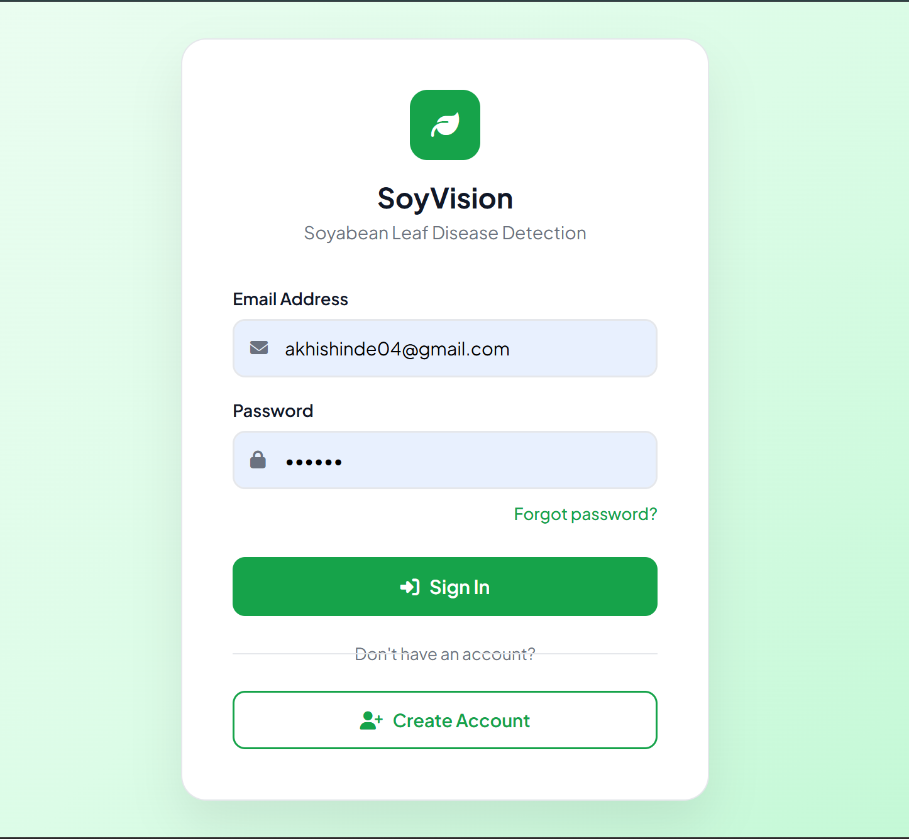
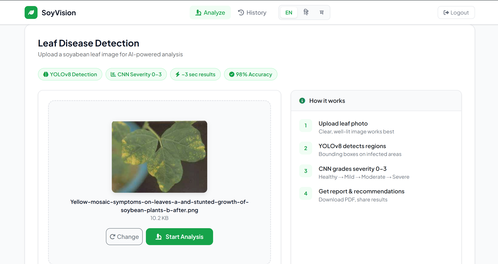
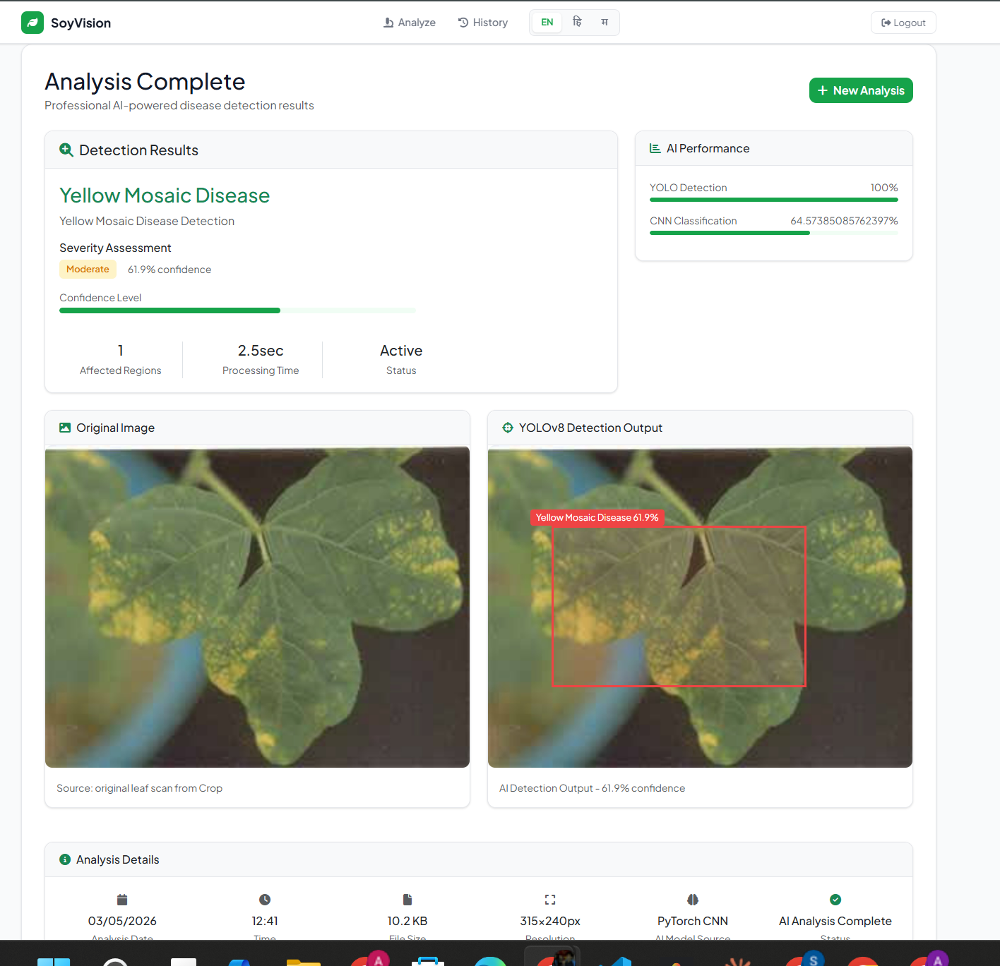

# 🌿 SoyVision — Soyabean Leaf Disease Detection

> AI-powered system for detecting and grading Yellow Mosaic Virus (YMV) in soyabean leaves using YOLOv8 and CNN — Published at **IEEE CNC 2025**


---

## 📄 Research Paper

**Title:** Soyabean Leaf Disease Detection with Severity Grading Using YOLOv8 and CNN  
**Conference:** IEEE International Conference on Communication Networks and Computing (CNC-2025)  
**Venue:** Rajkiya Engineering College, Sonbhadra, UP, India — December 29-30, 2025  
**Paper ID:** 675  
**Authors:** Akhilesh Shinde, Ansh Thakre, Divyansh Gupta, Akhilesh Chitare, Jagrut Denge, Prof. Nitin Barsagde

---

## 🎯 Problem Statement

Yellow Mosaic Virus (YMV) is a major soyabean disease in India's Vidarbha region, causing yield losses of up to **85%**. Traditional manual inspection is slow, error-prone, and identifies disease only after it has spread. This system provides instant AI-powered diagnosis.

---

## ✨ Features

- 🔍 **YOLOv8 Detection** — Detects infected leaf regions with bounding boxes
- 🧠 **CNN Severity Grading** — Classifies severity on 0–3 scale (Healthy → Mild → Moderate → Severe)
- ⚡ **Real-time Results** — Analysis in under 3 seconds per image
- 📊 **98% Accuracy** — Trained on 1,147 real field images from Maharashtra farms
- 📥 **PDF Reports** — Downloadable analysis reports
- 🔗 **Share Results** — Share analysis URL directly
- 📜 **History Tracking** — SQLite database for all past analyses
- 🌐 **Multilingual** — English, Hindi (हिंदी), Marathi (मराठी)
- 👤 **User Auth** — Register, Login, Password Reset

---

## 🏗️ System Architecture

```
User Upload (Web UI)
        ↓
   Preprocessing
(Resize, Normalize)
        ↓
  YOLOv8 Detector
(YMV Detection + Bounding Box)
        ↓
  CNN Classifier
(Severity Grading 0–3)
        ↓
Output (Bounding Box + Severity + Confidence + Recommendations)
```

---

## 📊 Model Performance

| Model | Accuracy | Precision | Recall | F1-Score | mAP@0.5 |
|-------|----------|-----------|--------|----------|---------|
| YOLOv8 Detector | 98% | 95% | 90% | 96% | 0.95+ |
| CNN Severity Classifier | 98.3% | 98% | 98% | 98% | — |

---

## 🛠️ Tech Stack

| Layer | Technology |
|-------|-----------|
| Backend | Python, Flask |
| ML Framework | PyTorch |
| Detection Model | YOLOv8 |
| Classification | Custom CNN |
| Frontend | HTML, CSS, Bootstrap 5 |
| Database | SQLite |
| Image Processing | Pillow, torchvision |

---

## 🚀 Getting Started

### Prerequisites
- Python 3.12+
- pip

### Installation

```bash
# Clone the repository
git clone https://github.com/akhishinde2004/SoyVision.git
cd SoyVision

# Install dependencies
pip install flask torch torchvision pillow numpy werkzeug

# Run the app
python app_main.py
```

Open your browser at `http://127.0.0.1:5000`

---

## 📱 Screenshots

| Login | Dashboard | Results |
|-------|-----------|---------|
|  |  |  |

---

## 📁 Project Structure

```
SoyVision/
├── app_main.py          # Main Flask application
├── models/
│   └── baseline_model.pth   # Trained CNN weights
├── static/
│   └── uploads/         # Uploaded leaf images
├── templates/
│   ├── base.html        # Base layout
│   ├── login.html       # Login page
│   ├── register.html    # Register page
│   ├── index.html       # Upload dashboard
│   ├── results.html     # Analysis results
│   ├── history.html     # Analysis history
│   └── view_analysis.html
└── README.md
```

---

## 🌾 Dataset

- **1,147 soyabean leaf images** collected from farms across Maharashtra's Vidarbha region
- Annotations: Bounding boxes + severity labels (0–3)
- Augmentation: Rotation, brightness variation, Gaussian noise, flips
- Split: 80% training / 20% testing

---

## 🔬 Disease Classes

| Class | Severity | Description |
|-------|----------|-------------|
| Healthy | 0 | No infection detected |
| Mild YMV | 1 | Early stage, minor yellowing |
| Moderate YMV | 2 | Significant yellow patches |
| Severe YMV | 3 | Extensive infection, major yield risk |

---

## 👨‍💻 Authors

- **Akhilesh Shinde** — [@akhishinde2004](https://github.com/akhishinde2004)
- Ansh Thakre
- Divyansh Gupta  
- Akhilesh Chitare
- Jagrut Denge
- **Guide:** Prof. Nitin Barsagde

*G. H. Raisoni College of Engineering and Management, Nagpur*

---

## 📜 Citation

If you use this work, please cite:

```
A. Shinde, A. Thakre, D. Gupta, A. Chitare, J. Denge and N. Barsagde,
"Soyabean Leaf Disease Detection with Severity Grading Using YOLOv8 and CNN,"
2025 IEEE International Conference on Communication Networks and Computing (CNC),
Sonbhadra, India, 2025.
```

---

## 📄 License

This project is for academic and research purposes.

---

<p align="center">Made with 🌿 for farmers of Vidarbha, Maharashtra</p>
